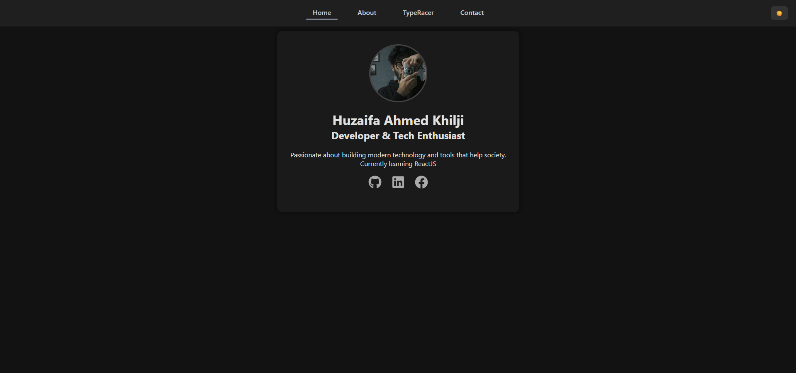

## 🧠 Personal Portfolio Website

A sleek, modern portfolio website built using **React.js** to showcase projects, skills, contact information, and an interactive **TypeRacer game**. The site is designed with smooth animations, responsive layouts, and a dark/light theme toggle to provide an aesthetic and user-friendly experience.

<br/>

### 🚀 Live Demo

[🔗 View the Website](https://your-portfolio-link.com)
*(Replace with your actual deployed link)*

---

### 🖼️ Preview


*You can include a screenshot or a GIF of your site here.*

---

### ✨ Features

* ⚛️ Built with **React.js**
* 🎨 Dark/Light Mode toggle
* 🧩 Interactive **TypeRacer** typing game
* 📄 Project Showcase section
* 📱 Fully responsive layout (mobile-friendly)
* 📬 Contact Form with basic validation
* 🌐 Social media links with hover effects
* 💅 Clean, modular component-based architecture

---

### 🛠️ Tech Stack

* **Frontend**: React.js, JSX, CSS
* **Design**: Flexbox, Responsive Design, Glassmorphism
* **Icons**: Emoji + Custom CSS
* *(Optional additions: TailwindCSS / Framer Motion if added later)*

---

### 📁 Folder Structure

```
src/
│
├── components/
│   ├── Navbar.jsx
│   ├── Home.jsx
│   ├── Projects.jsx
│   ├── Contact.jsx
│   ├── TypeRacer.jsx
│
├── styles/
│   ├── App.css
│   ├── Home.css
│   ├── Contact.css
│   ├── TypeRacer.css
│
├── App.jsx
└── index.jsx
```

---

### 🧩 Getting Started

#### 1. Clone the repo

```bash
git clone https://github.com/yourusername/portfolio-site.git
cd portfolio-site
```

#### 2. Install dependencies

```bash
npm install
```

#### 3. Start the development server

```bash
npm run dev
```

Your app should now be running at `http://localhost:5173` (if using Vite).

---

### 🔧 Customization

* Edit `Home.jsx` to update your name, bio, and profile image.
* Add or update your projects in `Projects.jsx`.
* Update `TypeRacer.jsx` for more challenges or gameplay improvements.
* Replace social links in `Contact.jsx` with your own.
* Tweak styles and color schemes in the respective `.css` files.

---

### 🎯 Deployment

You can easily deploy this portfolio using:

* [Vercel](https://vercel.com/)
* [Netlify](https://netlify.com/)
* [GitHub Pages](https://pages.github.com/)
* [Firebase Hosting](https://firebase.google.com/products/hosting)

---

### 🙌 Acknowledgments

This project is built and maintained by **\[Your Name]**
Want to collaborate or have feedback? Feel free to connect via [LinkedIn](https://linkedin.com/in/yourprofile) or [email](mailto:youremail@example.com)!

---

### 📄 License

MIT License. Feel free to fork, customize, and use it for your own portfolio.
